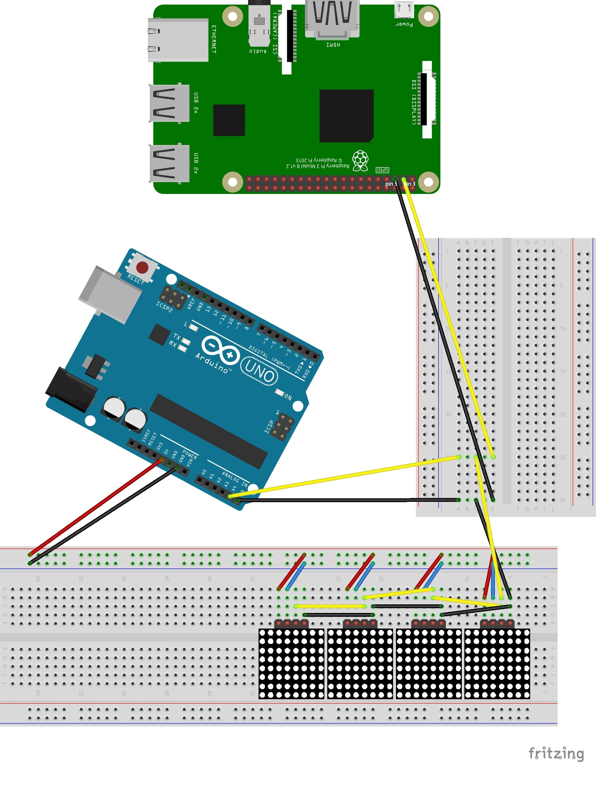

= Notice
:toc: right

This document describe how install and build hardware.

== Hardware connection

=== Requirements

* Raspberry Pi 3
* Arduino Uno
* 2 breadboard

=== Building

pin 3 raspberry -> pin 25 (line ABCDE) breadboard 1
pin 5 raspberry -> pin 30 (line ABCDE) breadboard 1

pin A4 arduino uno -> pin 25 (line ABCDE) breadboard 1
pin A5 arduino uno -> pin 30 (line ABCDE) breadboard 1
pin 5V arduino uno -> pin + (line ABCDE) breadboard 2
pin GND arduino uno -> pin - (line ABCDE) breadboard 2

pin 25 (line ABCDE) breadboard 1 -> pin 6 (line ABCDE) breadboard 2
pin 30 (line ABCDE) breadboard 1 -> pin 5 (line ABCDE) breadboard 2
pin power + (red) breadboard 2 -> pin 7 (line ABCDE) breadboard 2
pin power - (blue) breadboard 2 -> pin 8 (line ABCDE) breadboard 2
led (1) -> pin 5, 6, 7, 8 (line ABCDE) breadboard 2

pin 6 (line ABCDE) breadboard 2 -> pin 14 (line ABCDE) breadboard 2
pin 5 (line ABCDE) breadboard 2 -> pin 13 (line ABCDE) breadboard 2
pin power + (red) breadboard 2 -> pin 16 (line ABCDE) breadboard 2
pin power - (blue) breadboard 2 -> pin 15 (line ABCDE) breadboard 2
led (2) -> pin 13, 14, 15, 16 (line ABCDE) breadboard 2

pin 14 (line ABCDE) breadboard 2 -> pin 22 (line ABCDE) breadboard 2
pin 13 (line ABCDE) breadboard 2 -> pin 21 (line ABCDE) breadboard 2
pin power + (red) breadboard 2 -> pin 24 (line ABCDE) breadboard 2
pin power - (blue) breadboard 2 -> pin 23 (line ABCDE) breadboard 2
led (3) -> pin 21, 22, 23, 24 (line ABCDE) breadboard 2

pin 22 (line ABCDE) breadboard 2 -> pin 30 (line ABCDE) breadboard 2
pin 21 (line ABCDE) breadboard 2 -> pin 29 (line ABCDE) breadboard 2
pin power + (red) breadboard 2 -> pin 32 (line ABCDE) breadboard 2
pin power - (blue) breadboard 2 -> pin 31 (line ABCDE) breadboard 2
led (4) -> pin 29, 30, 31, 32 (line ABCDE) breadboard 2

https://learn.adafruit.com/animating-multiple-led-backpacks/wiring[Help for adressing Led here]
